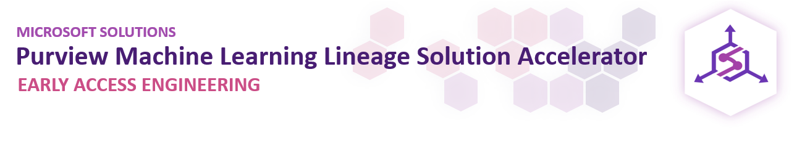
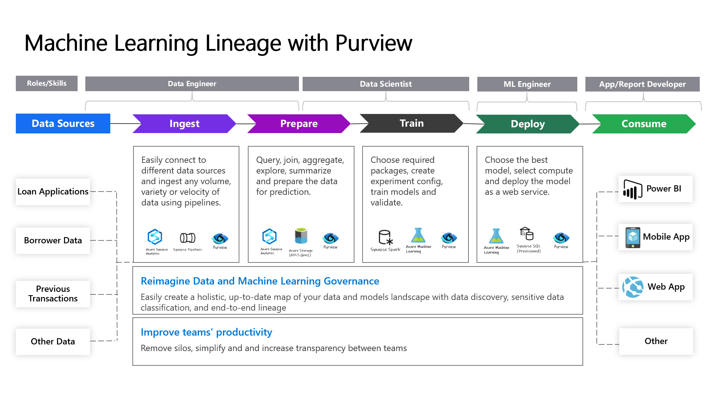
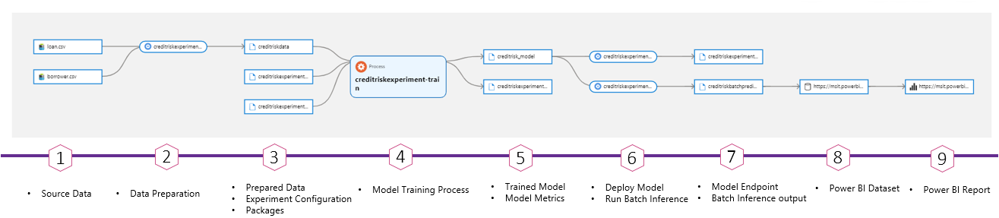
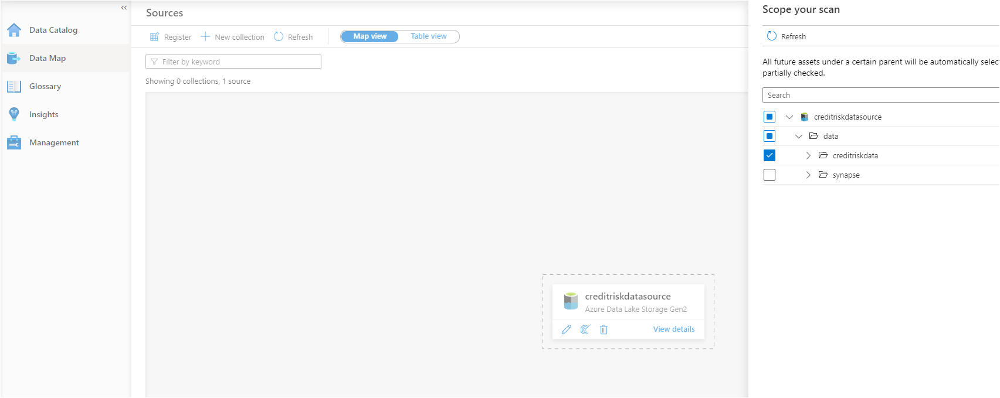
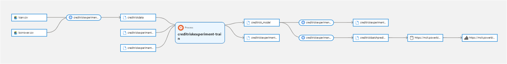
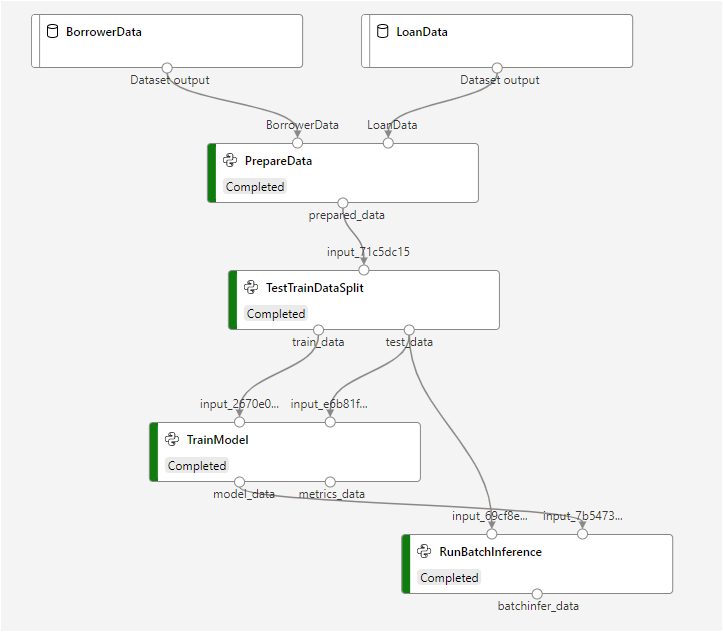
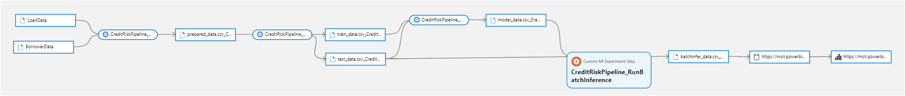
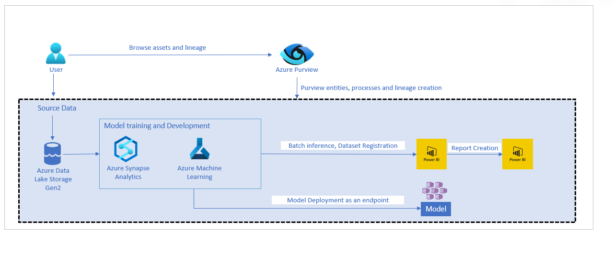

## About this Repository 

Azure Purview is a unified data governance service that helps you manage and govern data across different sources.

Machine Learning project life cycle involves many steps to transform raw data into insights. This process usually requires individuals with different roles/skillsets across multiple teams to collaborate effectively. Azure Purview helps simplify this complex process by providing an end-to-end lineage of ML entities and processes to enable better collaboration, auditing and debugging capabilities.

This solution accelerator helps developers with the resources needed to build an end-to-end lineage in Purview for Machine Learning scenarios.

## Sample Credit Risk Prediction ML Process Flow

## Purview ML Process Lineage

## Prerequisites
To use this solution accelerator, you will need access to an [Azure subscription](https://azure.microsoft.com/free/). While not required, a prior understanding of Azure Purview, Azure Synapse Analytics and Machine Learning will be helpful.

For additional training and support, please see:
1. [Azure Purview](https://azure.microsoft.com/en-us/services/purview/) 
2. [Azure Synapse Analytics](https://azure.microsoft.com/en-us/services/synapse-analytics/) 
3. [Azure Machine Learning](https://azure.microsoft.com/en-us/services/machine-learning/) 

## Getting Started
Start by deploying the required resources to Azure. The button below will deploy Azure Purview, Azure Synapse Analytics, Azure Machine Learning and its related resources:

If you prefer to setup manually, you need to deploy Azure Purview, Azure Synapse Analytics, Azure Machine Learning.

Note: To minimize Azure costs, consider deleting the Purview instance at the end of this exercise if you do not plan to use this instance actively. 

### Step 1. Download Files
Clone or download this repository and navigate to the project's root directory.

### Step 2. Purview Security Access

#### Step 2.1 Create a Service Principal for Purview Rest API access
[Create a service principal](https://docs.microsoft.com/en-us/azure/purview/tutorial-using-rest-apis#create-a-service-principal-application)

#### Step 2.2 Configure your Purview catalog to trust the service principal
[Configure your Purview catalog to trust the service principal](https://docs.microsoft.com/en-us/azure/purview/tutorial-using-rest-apis#configure-your-catalog-to-trust-the-service-principal-application)

### Step 3. Azure Machine Learning Security Access

#### Step 3.1 Create a Service Principal for AML access
[Create a service principal](https://docs.microsoft.com/en-us/azure/purview/tutorial-using-rest-apis#create-a-service-principal-application)

#### Step 3.2 Configure your Azure Machine Learning to trust the service principal
1. From the [Azure portal](https://portal.azure.com/), select your AML workspace
2. select Access Control (IAM)
3. Select Add, Add Role Assignment to open the Add role assignment page

	3.1 For the `Role` type in `Contributor`
	
	3.2 For `Assign access to` leave the default, `User, group, or service principal`
	
	3.2 For `Select` enter the name of the previosly created service principal in step 3.1 and then click on their name in the results pane
	
	3.3 Click on Save
You've now configured the service principal as a contributor on Azure Machine Learning resource.

### Step 4. Synapse Security Access

#### Step 4.1 Add your IP address to Synapse firewall
Before you can upload assests to the Synapse Workspace you will need to add your IP address:
1. Go to the Synapse resouce you created in the previous step
2. Navigate to `Firewalls` under `Security` on the left hand side of the page
3. At the top of the screen click `+ Add client IP`
	  
4. Your IP address should now be visable in the IP list

#### Step 4.2: Update storage account permisions 
In order to perform the necessary actions in Synapse workspace, you will need to grant more access.
1. Go to the Azure Data Lake Storage Account created above
2. Go to the `Access Control (IAM) > + Add > Add role assignment` 
3. Now click the Role dropdown and select `Storage Blob Data Contributor`
	- Search for your username and add
4. Click `Save` at the bottom

[Learn more](https://docs.microsoft.com/azure/synapse-analytics/security/how-to-set-up-access-control)

### Step 5. Upload CreditRisk Sample Dataset
1. Launch the Synapse workspace [Synapse Workspace](https://ms.web.azuresynapse.net/)
2. Select the `subscription` and `workspace` name you are using for this solution accelerator
3. In Synapse Studio, navigate to the `Data` Hub
4. Select `Linked`
5. Under the category `Azure Data Lake Storage Gen2` you'll see an item with a name like `xxxxx(xxxxx- Primary)`
6. Select the container named `data (Primary)`
7. Create a new folder `creditriskdata`
8. Select `Upload` and select `loan.csv` and `borrower.csv` files downloaded from [Data](./Data/) folder

### Step 6. Register and scan uploaded data in Purview

1. [Setting up authentication for a scan](https://docs.microsoft.com/en-us/azure/purview/register-scan-adls-gen2#managed-identity-recommended)

2. [Register and scan adls gen2](https://docs.microsoft.com/en-us/azure/purview/register-scan-adls-gen2#register-azure-data-lake-storage-gen2-data-source) 

select only the `creditriskdata` folder while creating the scan.

Wait for scan run status to change to `Completed` before running next step.

### Step 7. Upload Assets and Run Noteboks
1. Launch the Synapse workspace [Synapse Workspace](https://ms.web.azuresynapse.net/)
2. Select the `subscription` and `workspace` name you are using for this solution accelerator
3. Go to the `Manage` tab in the Synapse workspace and click on the `Apache Spark pools`

    - 
4. Click `...` on the deployed Spark Pool and select `Packages`
5. Click `Upload` and select [requirements.txt](/Deployment/requirements.txt) from the cloned repo and click `Apply` 
 
    - 

6. Go to `Develop`, click the `+`, and click `Import` to select all notebooks from the repository's `/SynapseNotebooks/` folder
7. For each of the notebooks, select `Attach to > spark1` in the top dropdown
8. Update Purview Tenant, Client Id and Secret from step `2.1` in `01_Authenticate_to_Purview_AML.ipynb`
9. Update Azure Machine Learning Tenant, Client Id and Secret from step `3.1` in `01_Authenticate_to_Purview_AML.ipynb`
10. Update `account_name` variable to your ADLS in `04_Create_CreditRisk_Experiment.ipynb`
11. Click `Publish all` to publish the notebook changes
12. Run the following notebook:
	- `04_Create_CreditRisk_Experiment.ipynb` (This notebook runs other notebooks you imported)
	
### Step 8. Check Machine Learning Lineage in Purview Studio
1. Launch [Purview Studio](https://ms.web.purview.azure.com/)
2. Click on `Browse Assets`
3. Click on `Custom Model` and select the model we created from running notebooks in `Step 7`
4. Click on `Lineage` to see Machine Learning process Lineage

### Step 9. Upload Assets and Run Azure Machine Learning Noteboks (Optional)
1. Launch the Azure Machine Learning studio [AML Studio](https://ml.azure.com/) 
2. Select the `subscription` and `workspace` name you are using for this solution accelerator
3. Go to the `Notebooks` tab in the AML Studio and upload the notebooks and scripts in `AML Notebooks` folder including `Data` folder
4. Go to the `Compute` tab in the AML Studio and click on the `Compute Instances` 
5. Click `New` and create a new compute instance
6. Click `Jupyter` and launch the compute instance
7. In the browser window that opens, click the folders to see the notebooks you uploaded in step `9.3`
7. Update Purview Tenant, Client Id and Secret from step `2.1` in `Authenticate_to_Purview_AML.py`
8. Update Azure Machine Learning Tenant, Client Id and Secret from step `3.1` in `Authenticate_to_Purview_AML.py`
9. Run the following notebooks in order:
	- `01_Create_CreditRisk_AML_Pipeline.ipynb` ( Pipeline run might take few minutes so please wait for completion before running the next notebook) 
	- `02_Create_CreditRisk_AML_Pipeline_Lineage.ipynb`	
	
	

### Step 10. Check Machine Learning pipeline Lineage in Purview Studio (Optional)
1. Launch [Purview Studio](https://ms.web.purview.azure.com/)
2. Click on `Browse Assets`
3. Click on `Custom ML Experiment Step` and select any step we created from running notebooks in `Step 9`
4. Click on `Lineage` to see Machine Learning pipeline Lineage

	
## Architecture
The architecture diagram below details what you will be building for this Solution Accelerator.

## License
MIT License

Copyright (c) Microsoft Corporation.

Permission is hereby granted, free of charge, to any person obtaining a copy
of this software and associated documentation files (the "Software"), to deal
in the Software without restriction, including without limitation the rights
to use, copy, modify, merge, publish, distribute, sublicense, and/or sell
copies of the Software, and to permit persons to whom the Software is
furnished to do so, subject to the following conditions:

The above copyright notice and this permission notice shall be included in all
copies or substantial portions of the Software.

THE SOFTWARE IS PROVIDED "AS IS", WITHOUT WARRANTY OF ANY KIND, EXPRESS OR
IMPLIED, INCLUDING BUT NOT LIMITED TO THE WARRANTIES OF MERCHANTABILITY,
FITNESS FOR A PARTICULAR PURPOSE AND NONINFRINGEMENT. IN NO EVENT SHALL THE
AUTHORS OR COPYRIGHT HOLDERS BE LIABLE FOR ANY CLAIM, DAMAGES OR OTHER
LIABILITY, WHETHER IN AN ACTION OF CONTRACT, TORT OR OTHERWISE, ARISING FROM,
OUT OF OR IN CONNECTION WITH THE SOFTWARE OR THE USE OR OTHER DEALINGS IN THE
SOFTWARE

## Note about Libraries with MPL-2.0 and LGPL-2.1 Licenses   
The following libraries are not **explicitly included** in this repository, but users who use this Solution Accelerator may need to install them locally and in Azure Synapse and Azure Machine Learning to fully utilize this Solution Accelerator. However, the actual binaries and files associated with the libraries **are not included** as part of this repository, but they are available for installation via the PyPI library using the pip installation tool.  
  
Libraries: chardet, certifi

## Contributing
This project welcomes contributions and suggestions.  Most contributions require you to agree to a Contributor License Agreement (CLA) declaring that you have the right to, and actually do, grant us the rights to use your contribution. For details, visit https://cla.opensource.microsoft.com.

When you submit a pull request, a CLA bot will automatically determine whether you need to provide a CLA and decorate the PR appropriately (e.g., status check, comment). Simply follow the instructions provided by the bot. You will only need to do this once across all repos using our CLA.

This project has adopted the [Microsoft Open Source Code of Conduct](https://opensource.microsoft.com/codeofconduct/). For more information see the [Code of Conduct FAQ](https://opensource.microsoft.com/codeofconduct/faq/) or contact [opencode@microsoft.com](mailto:opencode@microsoft.com) with any additional questions or comments.

## Trademarks
This project may contain trademarks or logos for projects, products, or services. Authorized use of Microsoft trademarks or logos is subject to and must follow [Microsoft's Trademark & Brand Guidelines](https://www.microsoft.com/en-us/legal/intellectualproperty/trademarks/usage/general). Use of Microsoft trademarks or logos in modified versions of this project must not cause confusion or imply Microsoft sponsorship. Any use of third-party trademarks or logos are subject to those third-party's policies.

## Data Collection
The software may collect information about you and your use of the software and send it to Microsoft. Microsoft may use this information to provide services and improve our products and services. You may turn off the telemetry as described in the repository. There are also some features in the software that may enable you and Microsoft to collect data from users of your applications. If you use these features, you must comply with applicable law, including providing appropriate notices to users of your applications together with a copy of Microsoft's privacy statement. Our privacy statement is located at https://go.microsoft.com/fwlink/?LinkID=824704. You can learn more about data collection and use in the help documentation and our privacy statement. Your use of the software operates as your consent to these practices.

